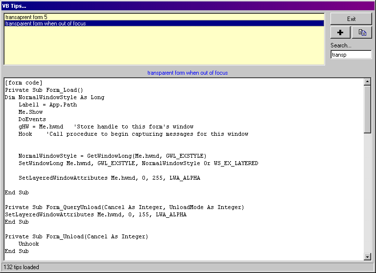



## Aaa\+ VB Tips manager and 120K sample code file

### Description

I use this vb sample code database every day. when I have a problem and find a solution, I put it in here.

Included is the sample code manager, sample code and the best non proportional font I've found (for the code window, which is set to courier for immediate playing!)

Enjoy
 
### More Info
 

             |
---                |---
**Submitted On**   |2002-07-17 08:35:46
**By**             |[Qucami](https://github.com/Planet-Source-Code/PSCIndex/blob/master/ByAuthor/qucami.md)
**Level**          |Intermediate
**User Rating**    |4.8 (38 globes from 8 users)
**Compatibility**  |VB 5\.0, VB 6\.0, VB Script
**Category**       |[Complete Applications](https://github.com/Planet-Source-Code/PSCIndex/blob/master/ByCategory/complete-applications__1-27.md)
**World**          |[Visual Basic](https://github.com/Planet-Source-Code/PSCIndex/blob/master/ByWorld/visual-basic.md)
**Archive File**   |[Aaa\+\_VB\_Ti1070877172002\.zip](https://github.com/Planet-Source-Code/qucami-aaa-vb-tips-manager-and-120k-sample-code-file__1-36982/archive/master.zip)

